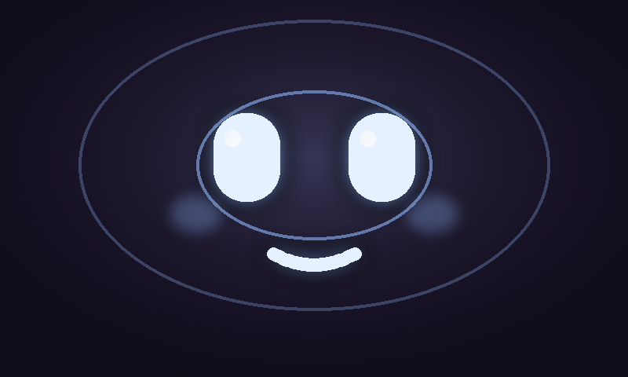

# 情緒陪伴機器人 — 臉部播放器

情緒陪伴機器人的**臉部顯示系統**，主要特色：

- **部署平台** — Raspberry Pi 4，搭載 800×480 螢幕
- **5 種說話情緒** — happy / sad / dejected / angry / speaking，採預烤分層 sprite + pygame 即時合成
- **即時 lip-sync** — 嘴型跟隨 TTS 實際音量包絡開合，同步率極高
- **6 種非說話狀態** — boot / idle / listening / thinking / sleep / error，播放預製 APNG 迴圈
- **情緒配樂** — 每種情緒配專屬 BGM；說話時自動 duck，結束後 unduck
- **TCP 指令介面** — 單行 JSON 即可驅動，輕鬆接入外部 STT / LLM / TTS pipeline

### 表情預覽

| happy | sad | dejected | angry | speaking |
|:-----:|:---:|:--------:|:-----:|:--------:|
|  |  |  |  |  |

| boot | idle | listening | thinking | sleep | error |
|:----:|:----:|:---------:|:--------:|:-----:|:-----:|
|  |  |  |  |  |  |

---

## 1. 專案架構

```
hearu-face-player/
│
├── face_player.py                  # 核心運行時：狀態機、lip-sync、微動作、TCP 指令介面
├── run_face.sh                     # Pi 用啟動腳本（設定環境變數）
├── face.service                    # systemd 使用者服務（Pi 開機自啟）
├── requirements.txt                # Python 相依套件
│
├── assets/
│   ├── sprites/                    # 5 種說話情緒的分層 PNG
│   │   ├── screen_<emotion>.png    # 背景＋環境光＋臉頰＋符號（不透明底層）
│   │   ├── brows_<emotion>.png     # 眉毛層
│   │   ├── eyes_open_<emotion>.png # 睜眼層
│   │   ├── eyes_closed_<emotion>.png
│   │   └── mouth_<emotion>_0..7.png  # 嘴型 8 格（0=閉合，7=最開）
│   └── apng/                       # 6 種非說話狀態的 APNG 迴圈
│       └── <state>.png             # boot / idle / listening / thinking / sleep / error
│
├── tools/
│   ├── render_layers.py            # 重新烘焙 assets/sprites/（改外觀／顏色時用）
│   └── render_apng.py              # 重新產生 assets/apng/
│
└── integration/
    ├── face_client.py              # 從外部 pipeline 驅動臉部（TCP 封裝＋情緒映射）
    ├── example_pipeline.py         # 端到端骨架，含 mock 實作，標好 4 個待替換點
    └── mac_say_test.py             # macOS 本機 lip-sync 測試工具（CLI 與互動 REPL）
```

---

## 2. 部署

### 2-1. macOS 本機開發測試（推薦先跑這個）

不需要 Pi，行為與 Pi 完全相同，方便快速驗證表情與對嘴效果。

#### 2-1-1. 安裝

```bash
# 建立 conda 環境（或用任何 Python 3.11 虛擬環境）
source ~/miniforge3/bin/activate
conda create -n py311_uihearu python=3.11 -y
conda activate py311_uihearu

# 安裝相依
pip install -r requirements.txt

# 複製專案
git clone https://github.com/newsiquare/hearu-face-player
cd hearu-face-player
```

#### 2-1-2. 啟動臉部（終端機 1）

```bash
FACE_WINDOWED=1 FACE_DEBUG=1 python face_player.py
```

啟動時可透過以下兩個環境變數控制執行模式：

| 參數 | `1`（開） | 不設或 `0`（關） |
|------|-----------|-----------------|
| `FACE_WINDOWED` | 以視窗模式執行（開發測試用） | 全螢幕執行（Pi 正式部署預設） |
| `FACE_DEBUG` | 右上角顯示目前狀態名稱（如 `IDLE`、`HAPPY`） | 畫面不顯示任何 debug 資訊 |

視窗開啟後，**鍵盤快捷鍵**（視窗需有焦點）：

| 按鍵 | 動作 |
|------|------|
| `1` | 切換為「開心」情緒＋對應 BGM |
| `2` | 切換為「難過」情緒＋對應 BGM |
| `3` | 切換為「沮喪」情緒＋對應 BGM |
| `4` | 切換為「生氣」情緒＋對應 BGM |
| `5` | 切換為「說話中」情緒＋對應 BGM |
| `Shift` + `1`～`5` | 同上，並額外播放示範語音（lip-sync 測試用） |
| `b` | 開機動畫（APNG） |
| `i` | 待機（APNG）＋ idle BGM |
| `l` | 聆聽（APNG）＋ listening BGM |
| `t` | 思考（APNG）＋ thinking BGM |
| `k` | 休眠（APNG，無 BGM） |
| `x` | 異常（APNG，無 BGM） |
| `Esc` / `q` | 離開 |

#### 2-1-3. 用 macOS TTS 測試 lip-sync（終端機 2）

> 前提：系統已安裝中文語音（系統設定 → 輔助使用 → 朗讀內容 → 管理聲音，下載「中文（台灣）」）

```bash
cd integration

# 一次性：指定情緒說一句話
python mac_say_test.py "我很開心見到你！" -e happy
python mac_say_test.py "你今天過得好嗎" -e sad
python mac_say_test.py "這樣不公平！" -e angry

# 換中文語音（選填，預設系統語音）
python mac_say_test.py "早安！" -e happy -v Meijia

# 只切換臉部狀態（不說話）
python mac_say_test.py --state thinking
python mac_say_test.py --state listening

# 互動 REPL（邊調邊試，最方便）
python mac_say_test.py
```

互動模式可用的指令：

```
直接打字          → 用目前情緒說話
:happy / :sad / :dejected / :angry / :speaking  → 換情緒
:voice Meijia     → 換語音
:rate 160         → 換語速（WPM）
:state thinking   → 只切狀態
:voices           → 列出所有可用語音
:quit             → 離開
```

---

### 2-2. Raspberry Pi 4 正式部署

#### 2-2-1. 硬體需求

- Raspberry Pi 4（RAM 2 GB 以上）
- 800×480 螢幕（DSI 排線或 HDMI 均可）
- 喇叭或耳機（3.5mm / USB / HDMI 音訊皆可）
- Raspberry Pi OS **Bookworm 64-bit 桌面版**（需要圖形工作階段）

#### 2-2-2. 安裝相依套件

```bash
sudo apt update
sudo apt install -y python3-pygame python3-pil python3-numpy fonts-noto-cjk

# 複製專案
git clone https://github.com/newsiquare/hearu-face-player ~/hearu-face-player
cd ~/hearu-face-player
```

若偏好 pip 管理：`pip install -r requirements.txt --break-system-packages`

#### 2-2-3. 確認音訊輸出

```bash
# 先確認 aplay 有聲音，再跑本程式
aplay /usr/share/sounds/alsa/Front_Center.wav
```

若無聲音，用 `raspi-config` → System Options → Audio 選對輸出裝置（3.5mm / HDMI / USB），
或在 `~/.asoundrc` 指定預設 sink。

#### 2-2-4. 先以視窗模式測試

```bash
cd ~/hearu-face-player
FACE_WINDOWED=1 FACE_DEBUG=1 python face_player.py
```

確認表情、音訊、鍵盤快捷鍵都正常後，再進行下一步。

#### 2-2-5. 設定開機自啟（擇一）

**方法 A — 合成器 autostart（最快）**

Bookworm 預設 Wayland（labwc）：

```bash
# 設定桌面自動登入
sudo raspi-config   # → System Options → Boot / Auto Login → Desktop Autologin

# 加入 autostart
mkdir -p ~/.config/labwc
echo "bash /home/$USER/hearu-face-player/run_face.sh &" >> ~/.config/labwc/autostart
```

若使用舊版 wayfire，改編輯 `~/.config/wayfire.ini` 的 `[autostart]` 區段。

**方法 B — systemd 使用者服務（建議，可自動重啟）**

```bash
loginctl enable-linger $USER
mkdir -p ~/.config/systemd/user
cp ~/hearu-face-player/face.service ~/.config/systemd/user/
systemctl --user daemon-reload
systemctl --user enable --now face.service

# 查看即時日誌
journalctl --user -u face.service -f
```

#### 2-2-6. 其他 Pi 設定

```bash
# 隱藏滑鼠游標（需安裝 unclutter）
sudo apt install -y unclutter
echo "unclutter -idle 0 &" >> ~/.config/labwc/autostart

# 關閉螢幕休眠（X11 環境）
echo "xset s off -dpms" >> ~/.xinitrc

# 若畫面全黑或顯示位置跑掉（Wayland/SDL 相容問題）
# 在 run_face.sh 加入：
export SDL_VIDEODRIVER=x11
# 或用 raspi-config → Advanced → Wayland 切回 X11
```

---

## 3. 與 STT/LLM/TTS Pipeline 整合

程式啟動會在 `127.0.0.1:8765` 開一個 TCP 指令介面（傳一行 JSON 即可）：

```python
import socket, json
def face(cmd):
    s = socket.socket(); s.connect(("127.0.0.1", 8765))
    s.sendall((json.dumps(cmd) + "\n").encode()); s.close()

face({"cmd": "state", "name": "listening"})              # 偵測到語音
face({"cmd": "state", "name": "thinking"})               # 送出辨識、等推論
face({"cmd": "speak", "emotion": "happy", "wav": "/tmp/reply.wav"})  # 播 TTS 並對嘴
# 講完會自動回到 idle
face({"cmd": "stop"})                                    # 中斷
```

`speak` 的 `wav` 給你 TTS 輸出的 wav 檔（16-bit PCM 最佳）；程式會即時算它的音量
包絡來開合嘴。`emotion` 從你的情緒判斷結果帶入（happy/sad/dejected/angry/speaking）。

典型流程：  
`待機 → VAD 觸發 state:listening → 辨識完 state:thinking → TTS 開始 speak(emotion,wav) → 講完自動回 idle`

也可改成 `import face_player`、直接呼叫 `Face` 物件的方法，省去 TCP。

---

## 4. 改造外觀

所有發光效果、顏色、嘴型形狀都定義在 `tools/render_layers.py` 的 `EMO` 與幾何參數裡。
改完後重新烘焙（需 Pillow + numpy，可在 Pi 或開發機上執行）：

```bash
python tools/render_layers.py     # 重新產生 assets/sprites/
python tools/render_apng.py       # 重新產生 assets/apng/
```

---

## 5. 待辦清單（Roadmap）

- [ ] **接真實 pipeline** — 替換 `integration/example_pipeline.py` 裡的 4 個 `# >>> REPLACE`（`wait_for_wake` / `record_and_transcribe` / `think` / `synthesize`），接上 STT / LLM / TTS 實作。
- [ ] **Pi 部署收尾** — 確認音訊 sink、設定開機自啟＋桌面自動登入、隱藏滑鼠游標、關閉螢幕休眠、確認顯示後端（Wayland / X11）。
- [ ] **新增情緒**（害羞 shy / 驚訝 surprised，尚未決定）— 在 `tools/render_layers.py` 的 `EMO` 與 `MOUTHS_M` 加入新情緒（眉毛姿態、符號、顏色），重新 bake。
- [x] **背景音樂** — 每種情緒配專屬器樂迴圈（用 Suno 付費版生成）；無縫迴圈、TTS 說話時自動 duck／結束後 unduck；已整合至 `face_player.py`（`BGM_MAP`）。

---

## 6. 參考資訊

### 6-1. 效能

純粹是預烤圖層的 blit，Pi 4 在 800×480 跑 60fps 非常輕鬆，
不像 Chromium 要每格重算 CSS 濾鏡。表面以 `convert_alpha()` 載入以加速。

### 6-2. 微動作個性對照（程式內 `PROFILE`）

| 情緒 | 視線 | 挑眉/壓眉 | 眨眼 | 浮動 |
|---|---|---|---|---|
| 開心 | 活潑 | 常挑眉（上） | 不眨（彎眼） | 大 |
| 說話中 | 一般 | 適度（上） | 正常 | 中 |
| 難過 | 慢、少 | 極少 | 慢 | 小 |
| 沮喪 | 最少 | 幾乎不動 | 最慢 | 小 |
| 生氣 | 中 | **壓眉（下）** | 正常 | 微 |
